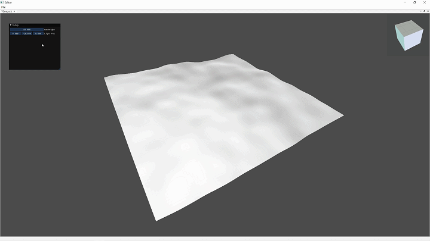

# Generate 3D world
This project shows how to use the Stone Engine to generate a 3D world

## How to build

```bash
git clone https://github.com/StoneHappy/3DWorld-Generate.git

cd 3DWorld-Generate

mkdir build

cd build 

cmake .. -DCMAKE_TOOLCHAIN_FILE=path to/vcpkg.cmake -DVCPKG_TARGET_TRIPLET=your target triplet

cmake --build ./ --config Release --target Generate3DWorld -j 10
```

## T1 NoiseTerrain

you can see commit hashid ``64d5c134bd5e9208d7f690e7c541933e313f403b``



## T2 QuadLod
[中文文档Chinese documents](docs/QuadLOD/README.md)

you can see commit hashid `f294e3c7c973aac55de0590b634d405380a3a806`


## Reference
[SimonDev's 3Dworld Generation playlist](https://www.youtube.com/watch?v=hHGshzIXFWY&list=PLRL3Z3lpLmH3PNGZuDNf2WXnLTHpN9hXy&index=1&ab_channel=SimonDev)


[SimonDev's 3Dworld Generation source code](https://github.com/simondevyoutube/ProceduralTerrain_Part1)
