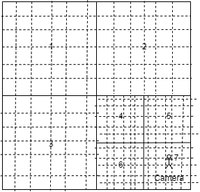
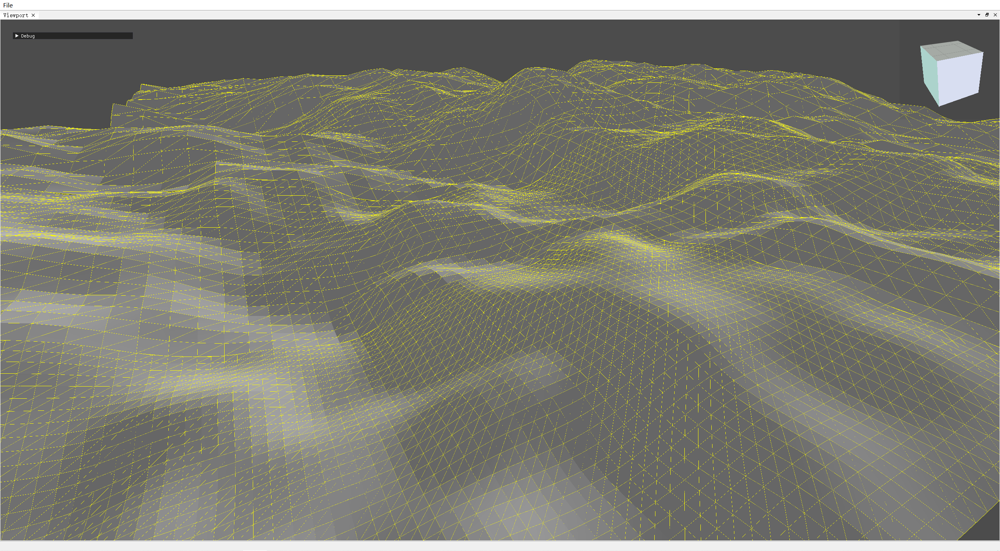

# 基于四叉树都是lod算法

## 四叉树构建
假设当前相机位置在如下图所示的场景中

则四叉树会将场景分成如下的及格**不同大小**区域（这里做了简化处理）

那四叉树是怎么将场景划分的呢？我们现在先将划分好的场景进行编号（起始正方形，即最大的那个正方形的编号为0）

然后我们先把四叉树画出来

这样就大概能看清死叉树是如何划分场景的了，可以看到，我们利用四叉树划分场景，只需要得到叶子节点即可，即没有子节点的节点。

接下去就是几个困扰我多年的问题。

1、那么在构建二叉树的时候如何判断这个节点是否要向下分出四个子节点呢？

只需要根据这个节点中心到相机位置的距离，如果小于这个节点空间的宽度**且这个节点的大小不能小于一定的值**（这也是构建四叉树递归的终止条件），则该节点就会向下分出四个子节点。

2、那么四个子节点如何划分父节点呢？

最简单粗暴的方法就是，均分，一个取其四分之一。

## 场景的构建
当利用四叉树划分好场景块大小分布之后，就是如何将场景的网格结构构建出来。

如下图所示，可以看到，同样是且把场景切成6分，小的块的线的密度更大，被切分成的小块也更小，肉眼嫩看到的网格锯齿就越小，此时场景就越精细。相比线密度越小的，如1、2、3块，每个小块被切分的很大，所以场景如果有锯齿的话，会很明显，看起来就没那么光滑平整。

## 效果图截图
